# Qeyadah Mobile

**Production-grade Flutter application for a driving-school platform — student & instructor experiences, bilingual (AR/EN), and clean architecture.**

[](https://flutter.dev)
[](https://dart.dev)
[](docs/ARCHITECTURE.md)
[](.github/workflows/ci.yml)
[](assets/l10n)

<p align="center">
  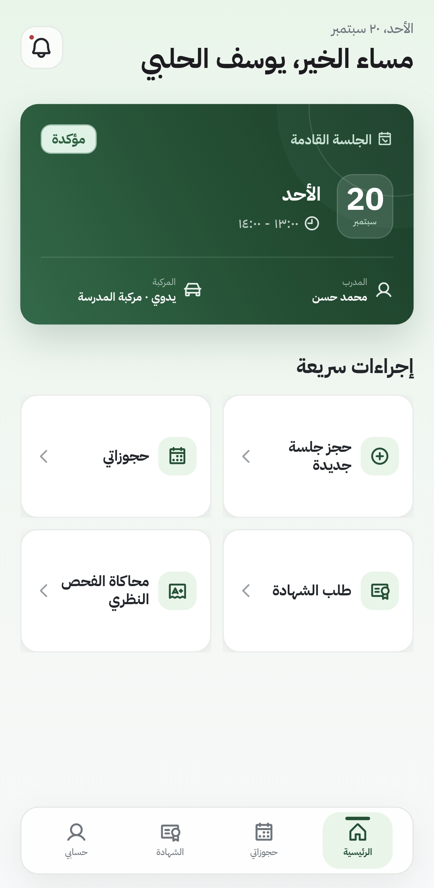
  &nbsp;
  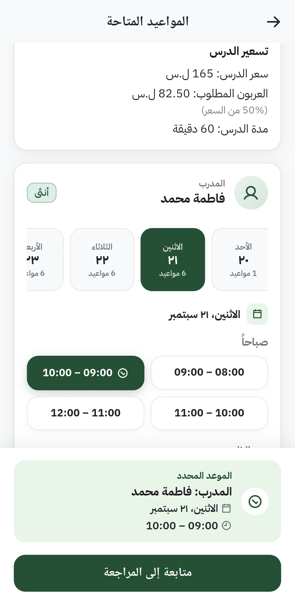
  &nbsp;
  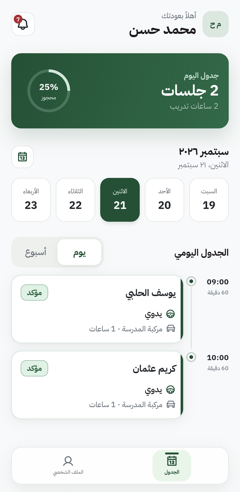
</p>

---

## Overview

**Qeyadah** is a full-featured mobile client for a driving-school management system. It connects students and instructors to backend services for scheduling, payments, certificates, theory exams, and push notifications.

The codebase is structured for **maintainability at scale**: feature-first modules, strict layering, typed error handling, and a vendored internal framework (`coore`) that standardizes networking, navigation, and state management across the app.

| Role | Capabilities |
|------|-------------|
| **Student** | Home dashboard, book driving sessions, manage bookings, pay online (Sham Cash), theory quiz, certificate requests & tracking, notifications |
| **Instructor** | Daily & weekly schedule, working hours, leave history, earnings & dues, invoices, profile |
| **Shared** | Auth (login, register, OTP, password reset), profile, bilingual RTL/LTR UI, light/dark appearance, offline queue (optional) |

---

## App screenshots

### Student experience

| Home | Book a session | Pick a slot |
|:---:|:---:|:---:|
|  | 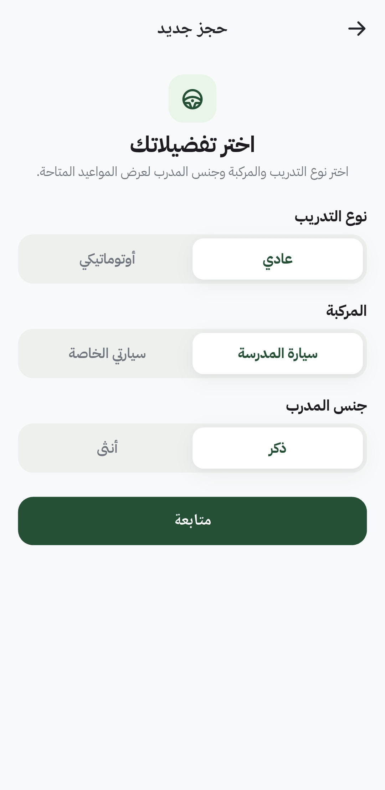 |  |
| Upcoming session, quick actions, bottom nav | Training type, vehicle, instructor preference | Pricing, instructor, date & time selection |

| Review booking | Sham Cash payment | My bookings |
|:---:|:---:|:---:|
| 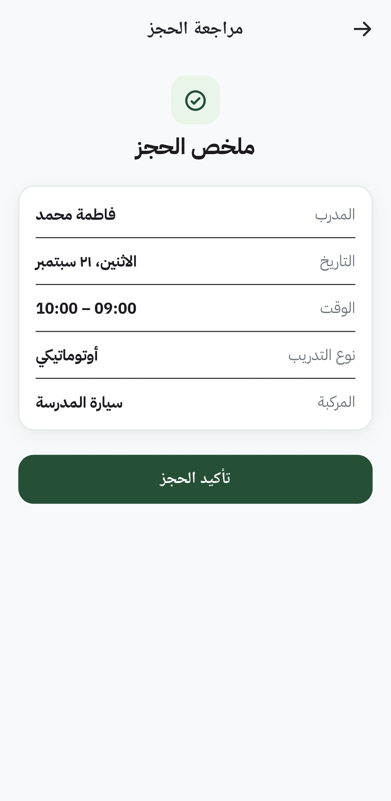 | 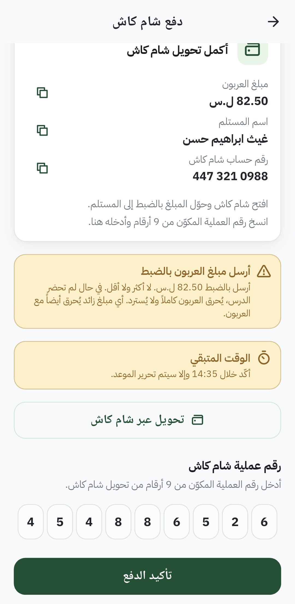 | 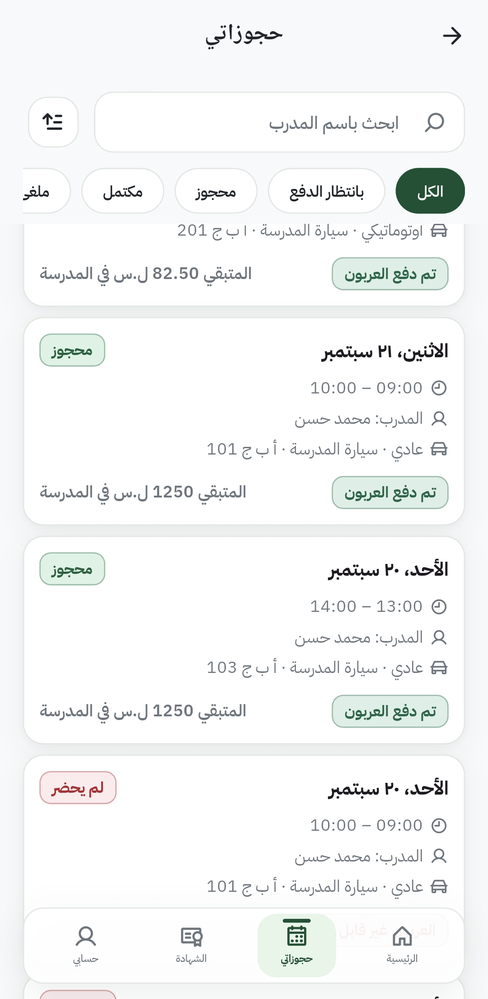 |
| Confirm instructor, date, vehicle | Deposit transfer with hold timer | Search, status filters, payment badges |

| Booking details | Certificates | Theory quiz | Notifications |
|:---:|:---:|:---:|:---:|
| 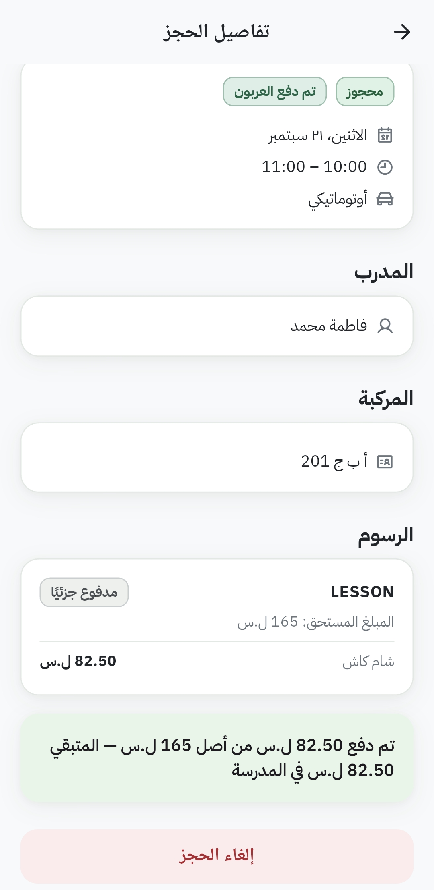 | 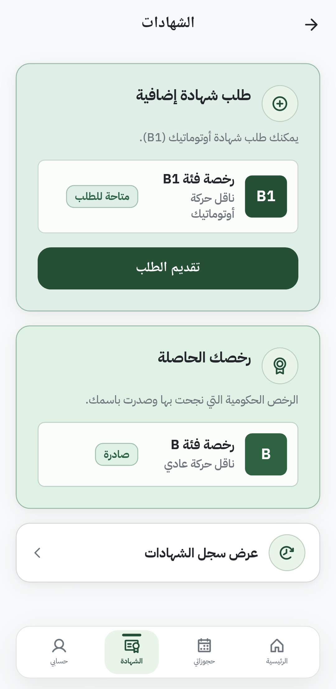 | 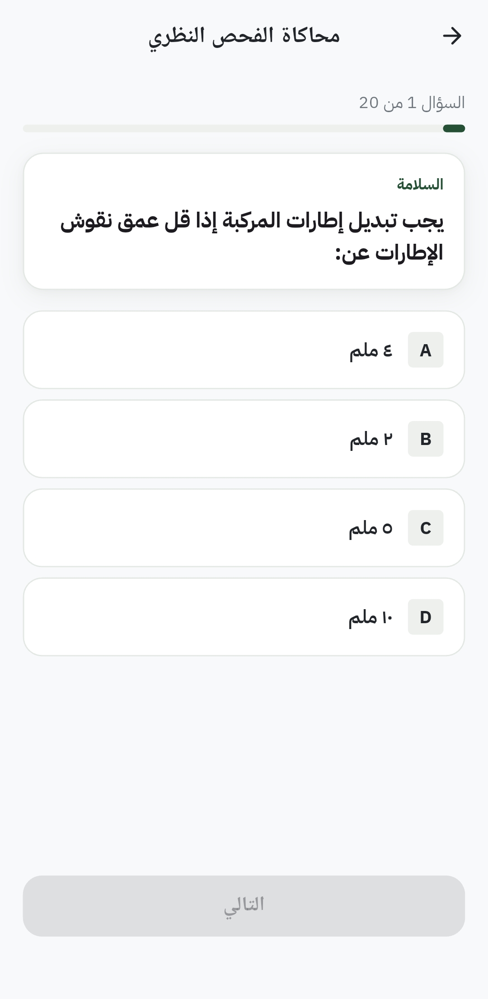 | 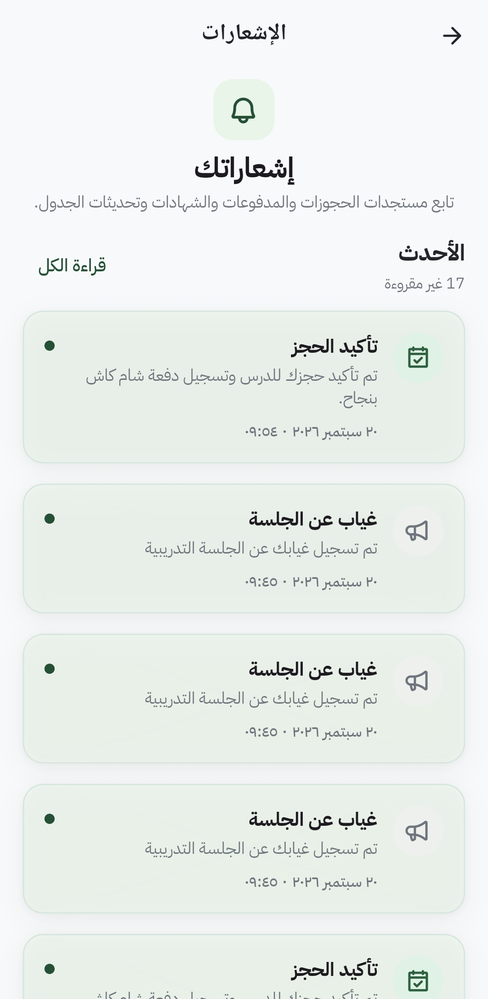 |
| Fees, vehicle, cancel flow | License hub & new requests | 20-question practice exam | Unread badges & mark-all-read |

### Instructor experience

| Day schedule | Week view | Working hours |
|:---:|:---:|:---:|
|  | 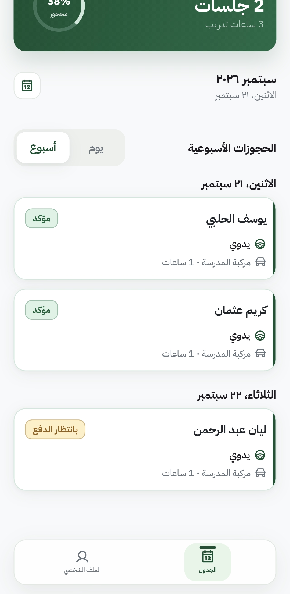 | 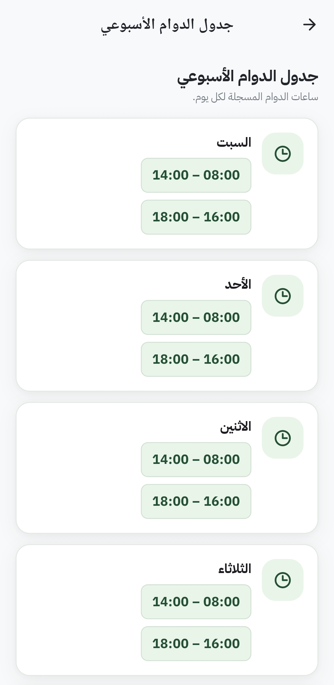 |
| Load %, sessions, attendance status | Confirmed & awaiting-payment cards | Multi-shift weekly availability |

| Earnings | Invoices | Profile |
|:---:|:---:|:---:|
| 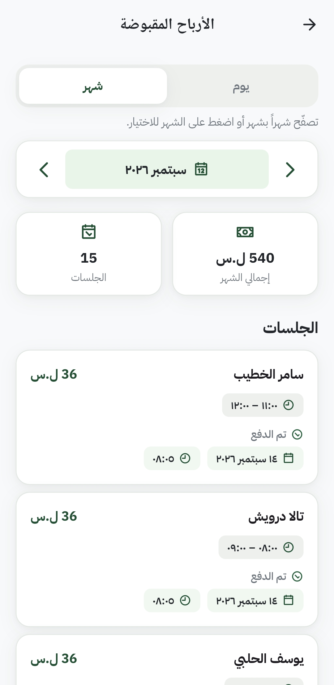 | 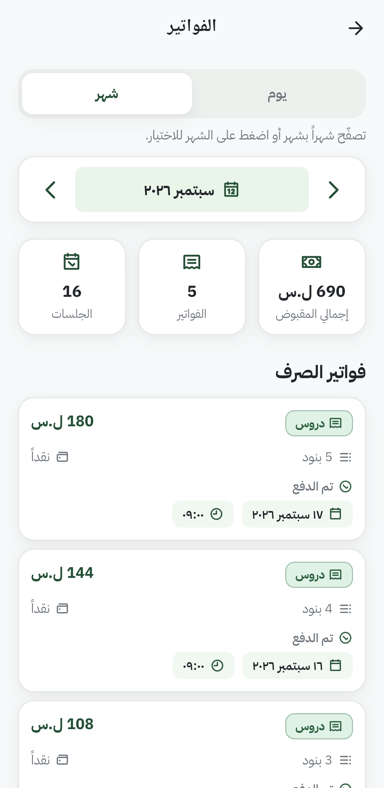 | 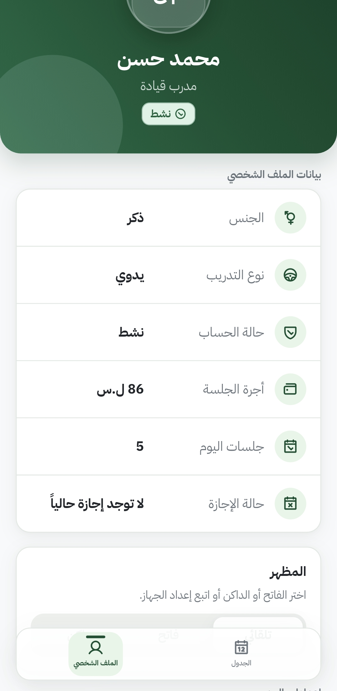 |
| Day/month totals & session list | Disbursement history & summaries | Fee, status, theme, today’s load |

---

## Highlights for reviewers

- **Clean architecture** — `presentation → domain → data` with repositories and use cases; no raw Dio in feature code
- **Predictable state** — `CoreCubit` + `ApiState`, checkout-style coordinators, sealed side-effects
- **Type-safe errors** — `Either<Failure, T>` end-to-end via `fpdart`
- **Dependency injection** — `get_it` + `injectable` code generation
- **Declarative routing** — `GoRouter` through `CoreNavigator` with feature navigation facades
- **Localization** — Arabic & English with ARB files and generated `AppLocalizations` (full RTL support)
- **Push notifications** — Firebase Cloud Messaging with graceful fallback when Firebase is not configured
- **Payments** — Sham Cash deposit flow with hold timer and transaction verification
- **Automated quality gates** — format, analyze, unit tests, and debug builds in CI

---

## Tech stack

| Layer | Technologies |
|-------|-------------|
| Framework | Flutter 3.41.6, Dart 3.9+ |
| State | `flutter_bloc`, `freezed`, custom `CoreCubit` / `ApiState` |
| Networking | Dio (via `coore` `ApiHandlerInterface`), interceptors, token refresh |
| DI | `get_it`, `injectable` |
| Navigation | `go_router`, `CoreNavigator` |
| Storage | Secure storage + Hive (session persistence) |
| Forms & UI | `typed_form_fields`, design tokens, skeleton loaders, pull-to-refresh |
| Notifications | `firebase_messaging`, `flutter_local_notifications` |
| Testing | `bloc_test`, `mocktail`, integration tests |
| Codegen | `build_runner`, `freezed`, `json_serializable`, `flutter_gen` |

---

## Architecture

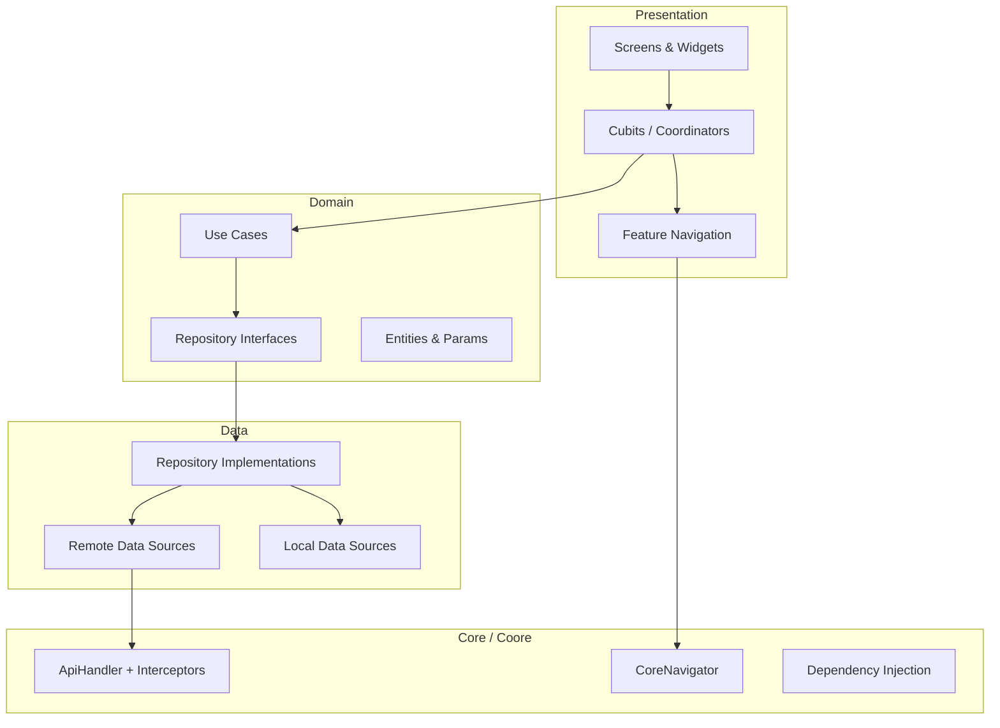

**Feature modules** live under `lib/src/features/` — each with its own `data/`, `domain/`, and `presentation/` layers. Cross-cutting infrastructure (theme, DI, offline queue, notifications) sits in `lib/src/core/`.

See the full [Architecture Report](docs/ARCHITECTURE.md) for design decisions and the `coore` split.

---

## Project structure

```
lib/
├── main_development.dart      # Dev entrypoint
├── main_staging.dart          # Staging entrypoint
├── main_production.dart       # Production entrypoint
├── main_common.dart           # Shared bootstrap
└── src/
    ├── core/                  # DI, theme, navigation, offline, notifications
    ├── features/
    │   ├── auth/              # Login, register, OTP, password reset
    │   ├── student_home/      # Student dashboard
    │   ├── student_booking/   # New booking flow
    │   ├── student_bookings/  # Booking history & detail
    │   ├── student_payments/  # Payment screens
    │   ├── student_certificates/
    │   ├── student_theory/    # Theory quiz flow
    │   ├── instructor/        # Instructor role modules
    │   ├── notifications/
    │   ├── profile/
    │   └── splash/
    └── shared/                # Cross-feature entities & types

packages/coore/                # Vendored internal framework
docs/screenshots/              # App UI screenshots used in this README
test/                          # Unit & widget tests
integration_test/              # End-to-end tests
docs/                          # Architecture, CI, best practices
```

---

## Getting started

### Prerequisites

- Flutter **3.41.6** (stable) — see [docs/CI.md](docs/CI.md)
- Android Studio / Xcode for device builds

### Setup

```bash
# 1. Clone and install dependencies
git clone https://github.com/Nawar-Altibi/Qeyadah-Driving-School-Application.git
cd Qeyadah-Driving-School-Application
flutter pub get

# 2. Create environment files from the template
cp .env.example .env.development
cp .env.example .env.staging
cp .env.example .env.production
# Edit BASE_URL and other values for your backend

# 3. (Optional) Configure Firebase for push notifications
# See docs/FIREBASE_SETUP.md
dart pub global activate flutterfire_cli
flutterfire configure

# 4. Generate code
dart run build_runner build --delete-conflicting-outputs
flutter gen-l10n

# 5. Run
flutter run -t lib/main_development.dart
```

### Environments

| Entrypoint | Env file | Purpose |
|------------|----------|---------|
| `lib/main_development.dart` | `.env.development` | Local development |
| `lib/main_staging.dart` | `.env.staging` | Pre-production QA |
| `lib/main_production.dart` | `.env.production` | Production release |

> **Note:** `.env` files are not committed. Use `.env.example` as a template. API credentials and signing keys must never be pushed to Git — see [SECURITY.md](SECURITY.md).

---

## Quality & CI

The same checks run locally and in GitHub Actions:

```bash
flutter pub get
dart run build_runner build --delete-conflicting-outputs
flutter gen-l10n
dart format --output=none --set-exit-if-changed lib test packages
flutter analyze --fatal-infos
flutter test
```

CI also builds a **debug APK** and **web** bundle on every push/PR to `main` and `develop`.

---

## Documentation

| Document | Description |
|----------|-------------|
| [Architecture](docs/ARCHITECTURE.md) | System design and `coore` boundaries |
| [Best practices](docs/BEST_PRACTICES.md) | Coding conventions for new features |
| [Coore reuse](docs/COORE_REUSE.md) | How to use the internal framework |
| [Firebase setup](docs/FIREBASE_SETUP.md) | Push notification configuration |
| [CI / CD](docs/CI.md) | Pipeline and release process |
| [Security](SECURITY.md) | Secret handling and reporting |

---

## Adding a new feature

Clone the reference module at `lib/src/features/sample_items/`. It demonstrates:

- Repository + use case stack with `Either<Failure, T>`
- Remote data source using `ApiHandlerInterface` only
- Coordinator pattern with sealed effects
- Feature navigation facade
- `RouteResumedRefresh` for child-route resume

---

## About this repository

This is a **portfolio showcase** of a real-world Flutter application built with production patterns. The backend API and Firebase project are private; environment configuration is provided via local `.env` files that are excluded from version control.

For security concerns, see [SECURITY.md](SECURITY.md).

---

## License

Source code is provided for review and portfolio purposes. All rights reserved unless otherwise agreed with the project owner.
